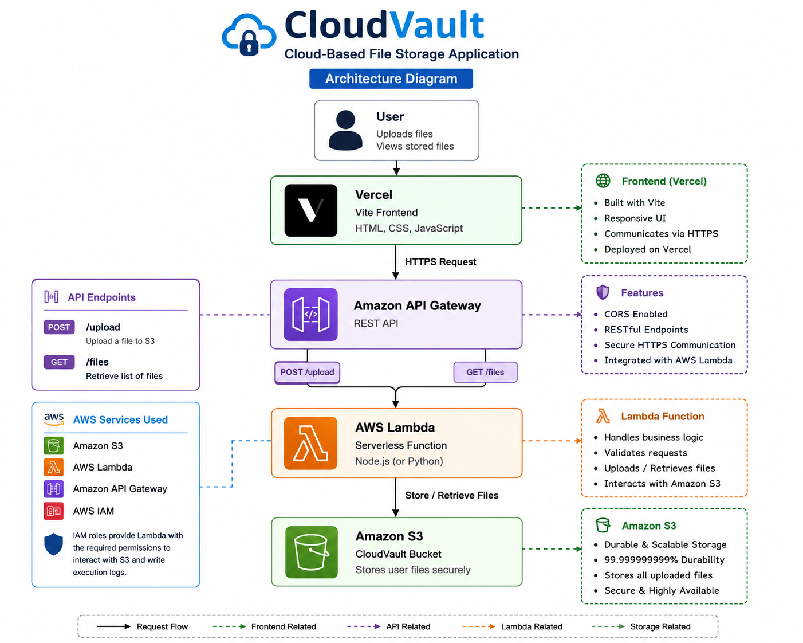

# ☁️ CloudVault — Cloud-Based File Storage Application

CloudVault is a cloud-based file storage application built with AWS. It allows users to upload files to Amazon S3 and retrieve a list of stored files through a web interface.

The project demonstrates how a modern frontend can communicate with serverless AWS services through API Gateway and AWS Lambda.

## 🚀 Live Demo

https://cloud-vault-azure.vercel.app/

## 🏗️ Architecture

User
↓
Vercel / Vite Frontend
↓
Amazon API Gateway
↓
AWS Lambda
↓
Amazon S3

For file listing, the response travels back through:

Amazon S3
↓
AWS Lambda
↓
API Gateway
↓
Frontend

### Architecture Diagram



## ✨ Features

- Upload files through a web interface
- Store files securely in Amazon S3
- Retrieve and display stored files
- Refresh the file list
- Serverless backend using AWS Lambda
- REST API endpoints through API Gateway
- CORS configuration for frontend/backend communication
- Live frontend deployment with Vercel

## ☁️ AWS Services Used

### Amazon S3

Used as the primary cloud storage service for uploaded files.

### AWS Lambda

Python Lambda functions handle:

- File uploads
- File retrieval/listing
- Communication with Amazon S3

### Amazon API Gateway

Provides HTTP endpoints for communicating with the Lambda functions.

Endpoints include:

```text
POST /upload
GET /files

AWS IAM

IAM roles provide Lambda with the required permissions to interact with Amazon S3 and write execution logs.

💻 Frontend

The frontend was built using:

Vite
JavaScript
HTML
CSS

The application communicates with the AWS API through HTTP requests.

🚀 Deployment
Frontend

The frontend is deployed using Vercel.

Backend

The backend runs using AWS serverless services:

API Gateway
Lambda
S3
Source Code

GitHub:

https://github.com/ayonitemiwisdom-ship-it/CloudVault

🧪 Testing

The application was tested by:

Uploading files through API Gateway/Postman.
Confirming successful Lambda responses.
Verifying uploaded objects in Amazon S3.
Connecting the Vite frontend to the AWS API.
Testing file listing from the frontend.
Testing file uploads from the live Vercel application.
Confirming uploaded files appeared in the S3 bucket.
🛠️ Technologies
Category	Technology
Cloud	AWS
Storage	Amazon S3
Compute	AWS Lambda
API	Amazon API Gateway
Identity & Access	AWS IAM
Frontend	JavaScript, HTML, CSS
Build Tool	Vite
Version Control	Git & GitHub
Deployment	Vercel
Development Environment	Linux / WSL
📚 What I Learned

This project provided practical experience with:

Designing a serverless cloud architecture
Working with Amazon S3
Creating and testing AWS Lambda functions
Connecting Lambda with API Gateway
Configuring CORS
Working with IAM permissions
Building a frontend that consumes cloud APIs
Testing APIs using Postman
Using Git and GitHub for version control
Deploying frontend applications with Vercel
Troubleshooting cloud and networking issues
🔮 Future Improvements

Potential future improvements include:

User authentication
Private file access
File deletion
File downloads
File size validation
File type validation
Presigned S3 URLs
CloudWatch monitoring
Infrastructure as Code using Terraform
CI/CD automation with GitHub Actions
👨‍💻 Author

Wisdom Ayonitemi

Cloud & DevOps Engineer

GitHub:
https://github.com/ayonitemiwisdom-ship-it

Live Application:
https://cloud-vault-azure.vercel.app/
